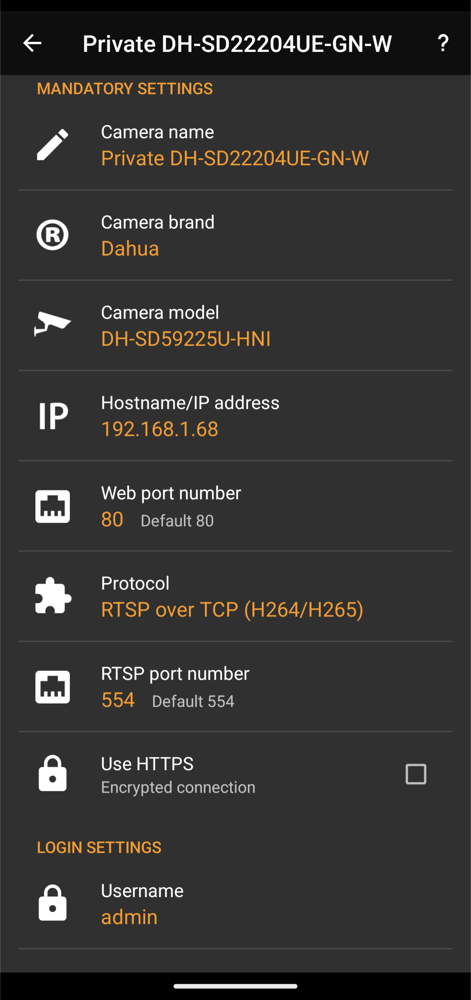

# DH-SD22204UE-GN-W
Camera DH-SD22204UE-GN-W setup in 'tinyCam PRO' Android app
# Setup in 'tinyCam PRO' Android app
This is how I setup 'tinyCam PRO' Android app to work with my camera DH-SD22204UE-GN-W of Dahua:
1. Name: Private DH-SD22204UE-GN-W
2. Vendor: Dahua
3. Model: DH-SD59225U-HNI
4. Hostname: 192.168.1.68
5. Web port: 80
6. Protocol: RTSP over TCP
7. RTSP port: 554
8. HTTPS: no
9. Username: admin
10. Password: [camerapassword]

Camera model was selected the first from cameras list.
I did no any changes in my router.